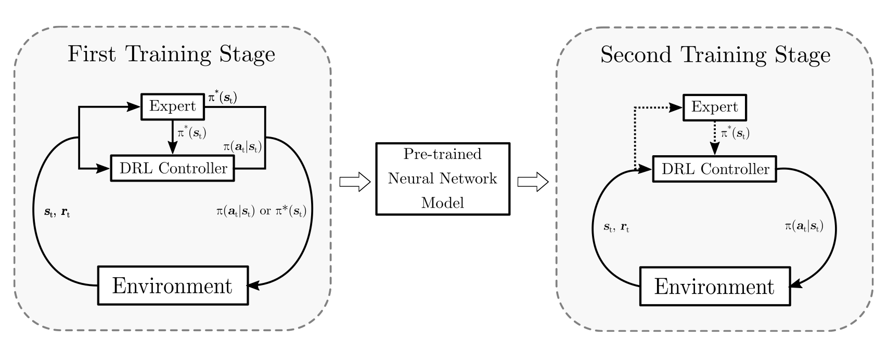

# Deep Reinforcement Learning-based Control for the Quadcopter with model-indications - using RaiSim v1.1.0
This repository is part of the study Thesis "Deep Reinforcement Learning-based Control for the Quadcopter with Model-Indications".
The DRL-based controller is trained in a two-staged training approach as illustrated in the Figure below. In the first training 
stage, a pre-training of the controller is performed with an Imitation Learning algorithm where an initial policy is trained with the Data Aggregation (DAgger) method. The supervised learning objective
is the control strategy of a PID controller for small angle conditions on the given states. Thereafter, the policy of the 
DRL-based controller is further trained in a second training stage with Proximal Policy Optimization (PPO), where the controller is
supposed to explore a more robust control strategy and enhance stability in a more challenging task.




## Getting Started
To run the code, a license of RaiSim is needed. RaiSim provides a commercial license, a trial license 
and an academic license which can be requested on https://raisim.com/sections/License.html.
The following instructions contain the steps for a setup on Linux.
For the installation on Mac or Windows, follow the instructions on https://raisim.com/sections/Installation.html.

### Dependencies
Before setting up RaiSim, the following dependencies need to be installed. It is recommended to set up a virtual environment 
like a conda environment (https://docs.anaconda.com/).
* Python > 3.5 (3.8 or higher recommended)
* Eigen3: `sudo apt-get install libeigen3-dev` 
* cmake > 3.10
* vulkan, minizip and ffmpeg: 
  * `sudo apt install minizip ffmpeg`
  * vulkan: https://linuxconfig.org/install-and-test-vulkan-on-linux
* PyTorch and cuda: follow the instructions on https://pytorch.org/get-started/locally/. If using graphics card for training acceleration, make sure you have min. 2 GB VRAM.

### Setup of RaiSim
Execute the following lines to download and setup RaiSim. It is recommended into clone the raisimLib repository to the home folder. 
```commandline 
git clone https://github.com/raisimTech/raisimLib.git
cd raisimLib 
mkdir build && cd build 
cmake .. -DCMAKE_INSTALL_PREFIX=~/raisim_install -DRAISIM_PY=ON 
make install -j4
```

### Setup of this Repository
Execute the following lines to download and setup this repository:
```commandline 
git clone https://github.com/Pala-Ah/drl_mi_quadcopter.git
cd drl_mi_quadcopter/raisimGym/scripts
bash init.sh
bash compile.sh
```
When executing `bash init.sh`, you will be asked to specify the directory to raisimLib. init.sh basically links
the algorithm and environment folders to the the raisimGymTorch module of raisimLib. compile.sh compiles the environments in
raisimGymTorch. Before running RaiSim, you also need to copy your activation key (license) into the folder /rsc. 
It is blacklisted by .gitignore and will not be uploaded into this repository in a commit.

## How to run the Scripts
The training and testing python-scripts are provided in the respective environment folders. The bash-files in the
raisimGym/scripts folder exemplify how to train, re-train or test an agent. There is also a folder provided with examples.
To visualize the simulation, you need to start raisimUnity or raisimUnityOpenGL which you can find in the raisimLib folder
of the original RaiSim library.
### Running a Pre-Trained Agent
This repository provides two pre-trained agents: the best performing from the respective training stages. For instance, 
to run the second stage agent in an environment with a sequence of targets, type:
```commandline 
cd $PATH_TO_REPOSITORY/raisimGym/scripts/evaluation
python agent_trajectory_multi_scenarios.py -w $PATH_TO_REPOSITORY/raisimGym/agents/best_performing_agents/stage_2/full_2800.pt -e target_sequence
```
for other environments, change the argument e.g. to `-e side_hit` or `-e random_state`.

### Running a Training
Two training environments are provided. For instance, to train an agent in the first stage with the DAgger method, type:
```commandline 
cd $PATH_TO_REPOSITORY/raisimGym/scripts/runner
python dagger_runner.py -e stage_1
```
The training configuration and parameters are defined in dagger_cfg.yaml.

## Folder Structure
* **raisim**: C++ version of the quadcopter simulation, controlled by a PID controller. Building it with cmake will add an executable to run the simulation.
* **raisimGym**: DRL training environment and scripts for automated training
  * **agents**: Pre-trained agents.
  * **algorithms**: Code library containing the Neural Network module and the DAgger, PPO and PID controller algorithms
  * **environments**: Different training and testing environments. The Environment.hpp file contains the simulation of the robot
  and the task setup. In some environments, it also contains the PID controller which provides a control feedback in the training phase
  * **helper**: an enironment helper for some additional functions. 
  * **scripts**: Setup, training and testing scripts. The running and testing scripts show how to run the respective scripts with and without a 
    pre-trained neural network model.
* **raisimPy**: The python version of the quadcopter simulation. It solely launches the quadcopter.
* **rsc**: contains the urdf model of the quadcopter and the activation key.


